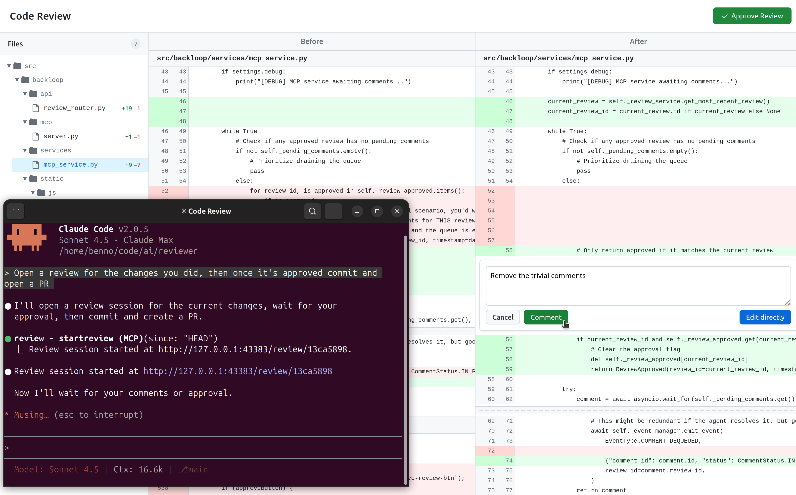

<div align="center">

</div>

# Backloop Code Review

A fully local code review platform for creating high-quality AI-assisted PRs.

## Overview

Coding assistants do great on many tasks, but they are still lacking when
working on big, established code bases. In particular, getting code from a
working prototype to review-grade version that meets all coding standards often
requires a significant amount of manual polishing, that can easily eat up
the initial efficiency gains.

Backloop provides a streamlined workflow for reviewing code changes with
AI assistance, providing live feedback and an instant feedback loop.



It works by spinning up an ad-hoc web server that hosts a GitHub-like code
review UI that's linked to the current coding session.

For the assistant, the workflow looks like this:

1. Start a review by calling `startreview()` and give the returned URL to the user
2. Call `await_comments()`, and ...
3. ... if receiving a comment, work on it and call `receive_comment()`
4. ... if receiving REVIEW APPROVED, done.

For the user, the workflow looks like this:

1. Open the link to the review
2. Leave comments with feedback, or edit small touch-ups directly
3. When satisfied with the code, approve the review.

## Installation

To add the MCP server to Claude Code, run:

```bash
claude mcp add local-review -- uvx --from backloop backloop-mcp
```

or the equivalent for your LLM frontend of choice.

## Standalone Usage

You can also use Backloop without an agent, as a standalone local diff
viewer:

```bash
uvx --from backloop server
```

This starts the web server which you can use to view and comment on
diffs manually.

## MCP Tools Reference

Once configured, Claude has access to these MCP tools:

### `startreview()`

Starts a new review session. Exactly one parameter must be specified:

- `since='HEAD'` - Review changes since a given commit, including uncommited changes
- `commit='abc123'` - Review a specific commit
- `range='main..feature'` - Review a range of commits

**Examples:**

- Review changes before committing: `startreview(since='HEAD')`
- Review changes after committing: `startreview(since='HEAD~1')`
- Review changes to a PR branch: `startreview(range='origin/main..HEAD')`

### `await_comments()`

Blocks until either a comment is posted or the review is approved.
Returns comment details (including the originating `review_id`) or "REVIEW APPROVED".

### `resolve_comment()`

Marks a specific comment as resolved by its ID.
